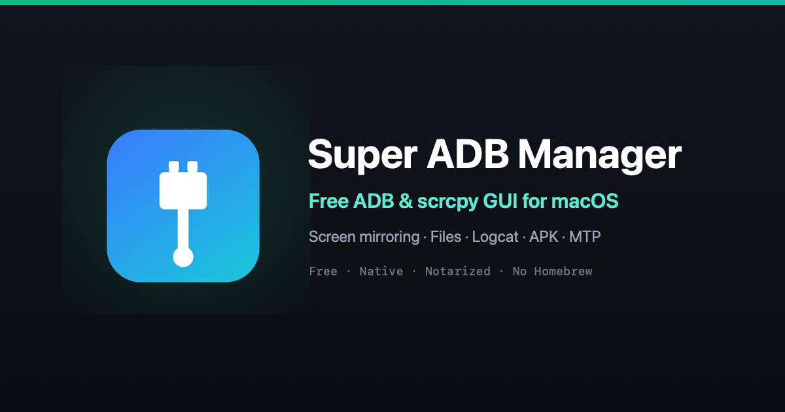
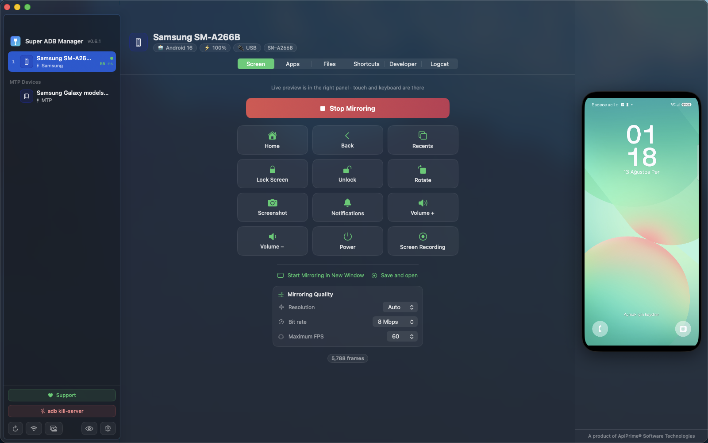
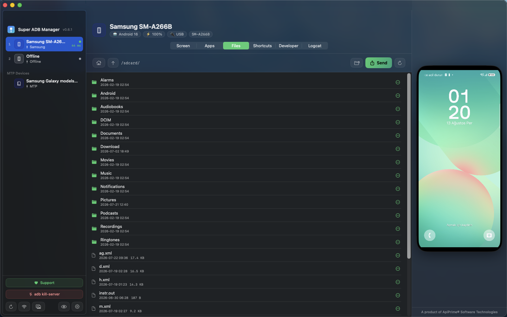
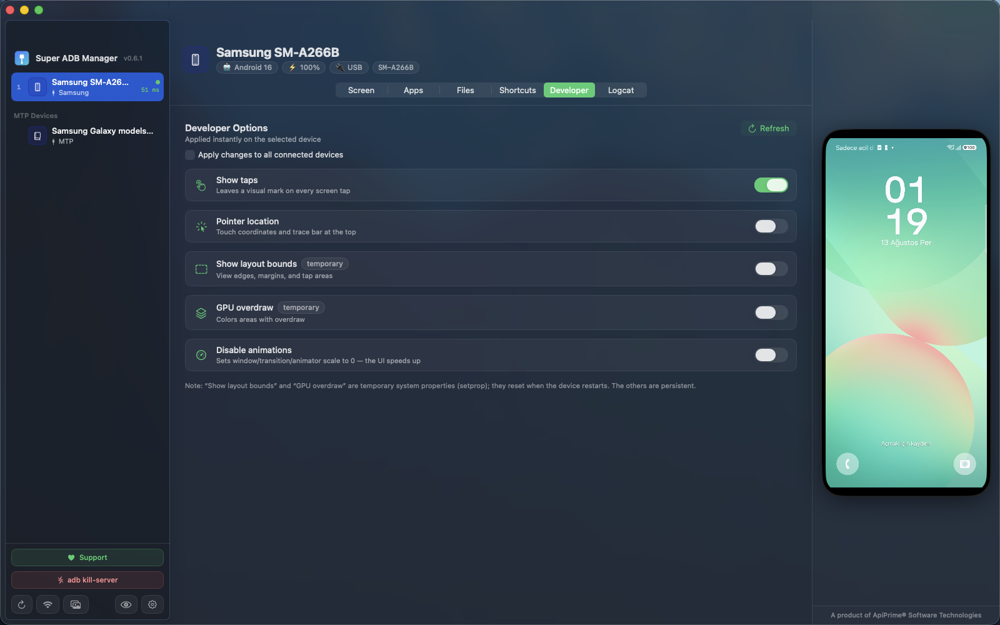
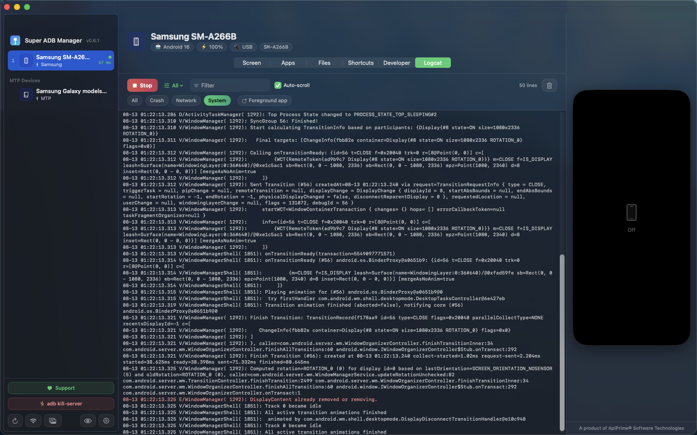

# Super ADB Manager — a free, native ADB & Android screen mirroring app for macOS

**Manage your Android phone from your Mac. No terminal. No Homebrew. No account.**

Super ADB Manager is a native SwiftUI app for macOS that mirrors your Android screen, installs APKs, browses device files, streams logcat and flips developer options — with `adb` and the `scrcpy` server **bundled inside the app**. Download the DMG, drag it to Applications, plug in your phone. That's it.

  

  <a href="https://github.com/apiprime/super-adb-manager-releases/releases/latest/download/SuperADBManager.dmg"><b>⬇️ Download for macOS (free)</b></a>
  &nbsp;·&nbsp;
  <a href="https://adb.apiprime.com"><b>Website</b></a>

  
  
  
  
  

---

## Screenshots

<table>
  <tr>
    <td width="50%"> <b>In-app screen mirroring</b> — scrcpy, decoded with VideoToolbox</td>
    <td width="50%"> <b>File manager</b> — browse /sdcard, drag files both ways</td>
  </tr>
  <tr>
    <td width="50%"> <b>One-click developer options</b> — apply to one device or all</td>
    <td width="50%"> <b>Advanced logcat viewer</b> — live stream, filters, search</td>
  </tr>
</table>

## Why another ADB tool?

Most Mac workflows for Android still look like this: install Homebrew, `brew install android-platform-tools scrcpy`, remember the flags, keep a terminal tab open forever. And Google's old Android File Transfer is dead on modern macOS.

Super ADB Manager puts all of it behind a normal Mac window:

- **Zero setup** — `adb` and the `scrcpy` server ship inside the app bundle. Nothing to install, nothing to update by hand.
- **Native, not Electron** — SwiftUI + VideoToolbox hardware decoding, built for Apple Silicon.
- **Everything in one window** — mirroring, apps, files, logs, developer options, wireless pairing.
- **MTP too** — it also talks to MTP devices that have no ADB at all, including **Amazon Kindle**, cameras and MP3 players.
- **Free, no ads, no account** — telemetry is **off by default** and opt-in.

## Features

### 📱 Multi-device sidebar
All connected devices at a glance: brand detection with brand colours, model, Android version, battery %, USB or Wi-Fi, and live latency in milliseconds. Drag to reorder, right-click to switch to wireless, disconnect or copy the serial.

### 🪞 In-app screen mirroring
Live device screen **inside the app** using the scrcpy protocol, decoded with VideoToolbox. Full input: click to tap, drag to swipe, right-click for Back, and type with your Mac keyboard. "Live follow" mirrors whichever device you select. You can also pop out a full scrcpy window or start mirroring with recording.

### ⌨️ Quick controls
Home, Back, Recents, Lock, Unlock, Rotate, Screenshot (straight to your clipboard), Notification shade, Volume ±, Power, and screen recording.

### 📦 App & APK manager
List and search installed packages (user or system), **install APKs by drag & drop including split/multi-APK**, launch, pull the APK back to your Mac, clear data, uninstall.

### 📁 File manager
Browse `/sdcard` with sizes and dates, pull to Mac or push to device by drag & drop, create folders, delete.

### 🔌 MTP file manager (the part nobody else does)
Devices that expose MTP but not ADB — **Kindle e-readers**, cameras, DAPs — show up as browsable storage and support copying files both ways. No ADB, no developer mode, no Android File Transfer.

### 🛠 One-click developer options
Show touches, pointer location, layout bounds, GPU overdraw, disable animations — applied to one device or to every connected device at once.

### 📜 Advanced logcat viewer
Live log stream with colour coding, priority filter (All / Info / Warning / Error / Fatal), preset filters (crashes, network, system, foreground app) and free-text search.

### 📶 Wireless ADB
Scan the local network over mDNS, run `adb pair` with a pairing code, connect by IP, or flip a USB device to wireless in one click.

### 🖼 Screenshot & recording gallery
Everything you capture lands in an in-app gallery you can preview, reveal in Finder or delete.

### 🎨 7 themes · 🌍 15 languages
Seven accent themes (Indigo, Ocean, Emerald, Sunset, Rose, Gold, Graphite) and a fully localized UI in 15 languages — Turkish, English (US/UK), German, French, Spanish, Italian, Chinese, Japanese, Portuguese, Russian, Korean, **Arabic (full RTL)**, Hindi and Indonesian. It follows your system language automatically.

## Install

1. **[Download the DMG](https://github.com/apiprime/super-adb-manager-releases/releases/latest/download/SuperADBManager.dmg)** (~27 MB).
2. Open it and drag **Super ADB Manager** into Applications.
3. Launch it. The app is signed with a Developer ID and **notarized by Apple**, so there is no Gatekeeper warning and no right-click → Open dance.

Every release ships with a `SuperADBManager.dmg.sha256` checksum on the [Releases page](https://github.com/apiprime/super-adb-manager-releases/releases/latest).

### Requirements

| | |
| --- | --- |
| Mac | Apple Silicon (M1 or newer), macOS 13 Ventura or later |
| Phone | Android with **USB debugging** enabled (Developer options), plus the on-device authorization prompt accepted |
| Homebrew / adb / scrcpy | **Not required** — bundled |
| MTP devices (Kindle, etc.) | Just plug in — no ADB needed |

## FAQ

**Is it free?** Yes. No trial, no ads, no accounts, no in-app purchases.

**Do I need Homebrew, adb or scrcpy installed?** No. Both binaries are inside the app bundle. If you *do* have your own copies, point the app at them with `SUPERADB_ADB` / `SUPERADB_SCRCPY` environment variables.

**Does it work on Intel Macs?** Not today — the build is Apple Silicon only.

**Is it on the Mac App Store?** No. USB/ADB access can't live inside the App Store sandbox, so it's a direct, notarized download.

**Does it phone home?** Telemetry is opt-in and **off by default**. Nothing leaves your Mac unless you turn it on.

**Is the source open?** No — Super ADB Manager is free but proprietary software. The open-source components it bundles (scrcpy, adb, FFmpeg, libusb, libmtp, SDL2 and others) keep their own licenses; see [`licenses/THIRD-PARTY-NOTICES.md`](licenses/THIRD-PARTY-NOTICES.md) for full texts and the written offer for GPL/LGPL sources.

**My screen recording fails.** Some vendors (HONOR/Huawei in particular) restrict `screenrecord` at the OS level. Mirroring still works.

## Related tools it replaces

If you currently juggle raw `scrcpy` and `adb` in a terminal, Android File Transfer, or a paid Android-on-Mac utility, this is the same job in one native window. Useful for Android developers, QA engineers, support teams, and anyone who just wants files off their phone.

## Links

- 🌐 Website & download: **https://adb.apiprime.com**
- 📦 All releases & checksums: [Releases](https://github.com/apiprime/super-adb-manager-releases/releases)
- 🐞 Bug reports & feature requests: this repository's **Issues** tab
- ✉️ Contact: info@apiprime.com
- 🏢 Made by [ApiPrime® Software Technologies](https://apiprime.com)

## License

Super ADB Manager is **free to use** for personal and commercial purposes. The app itself is proprietary; see [`LICENSE`](LICENSE). Bundled third-party components are distributed under their own licenses — details in [`licenses/THIRD-PARTY-NOTICES.md`](licenses/THIRD-PARTY-NOTICES.md).

---

Keywords: ADB GUI for macOS, Android screen mirroring on Mac, scrcpy GUI Mac, Android file transfer macOS alternative, APK installer for Mac, logcat viewer macOS, wireless ADB, MTP file manager for Kindle on Mac, Apple Silicon Android tool.
